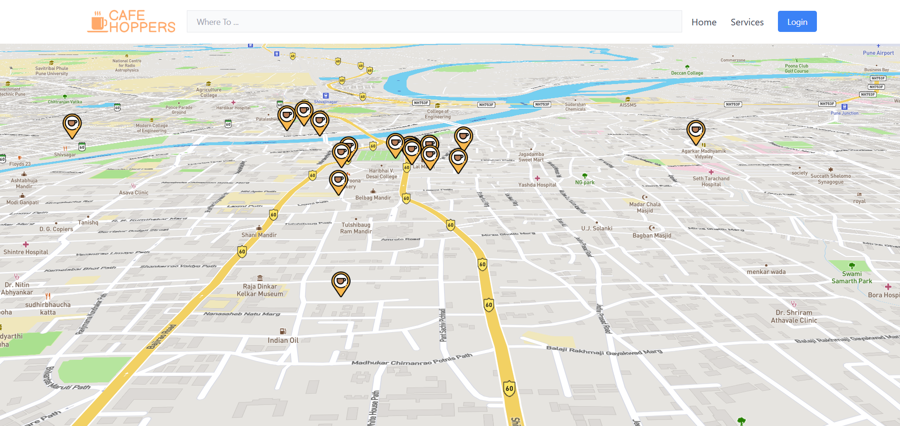

# ☕ Café Hopper

> A modern web application that helps users discover and explore cafés in their vicinity using interactive maps and real-time search suggestions.

[](https://reactjs.org/)
[](https://golang.org/)
[](https://gofiber.io/)
[](https://docs.mapbox.com/mapbox-gl-js/)
[](LICENSE)

Built with **React (Vite)** on the frontend and **Go Fiber** on the backend, integrating **Mapbox** and **Google Places API** for an interactive, location-based experience.

---

## 📸 Screenshots

<div align="center">
  
### 🏠 Home Page
  


### 🏪 Café Details Card


### 🔍 Live Search Feature


</div>

---

## ✨ Features

- 🔍 **Live Café Search** - Real-time autocomplete using Google Places API
- 🗺️ **Interactive Maps** - Beautiful Mapbox integration with café markers  
- ⚡ **Lightning Fast** - Optimized with Go routines and Vite build system
- 🧠 **Smart Backend** - Debounced, rate-limited search with efficient caching
- 📚 **API Documentation** - Complete Swagger UI for testing endpoints
- 🎨 **Modern UI** - Responsive design with Tailwind CSS
- 🐳 **Docker Ready** - Easy deployment with Docker Compose

---

## 🛠️ Tech Stack

### Frontend
| Technology | Purpose |
|------------|---------|
| [React.js](https://reactjs.org/) | UI Framework |
| [Vite](https://vitejs.dev/) | Build Tool & Dev Server |
| [Mapbox GL JS](https://docs.mapbox.com/mapbox-gl-js/) | Interactive Maps |
| [Google Places API](https://developers.google.com/maps/documentation/places/web-service/overview) | Location Search |
| [Tailwind CSS](https://tailwindcss.com/) | Styling Framework |

### Backend
| Technology | Purpose |
|------------|---------|
| [Go](https://golang.org/) | Programming Language |
| [Fiber](https://gofiber.io/) | Web Framework |
| [GoDotEnv](https://github.com/joho/godotenv) | Environment Variables |
| [MySQL](https://www.mysql.com/) | Database |

---

## 📁 Project Structure

```
cafe-hopper/
├── 📁 frontend/                # React + Vite frontend
│   ├── 📁 public/
│   └── 📁 src/
│       ├── 📁 components/
│       ├── 📁 pages/
│       └── 📄 App.jsx
│
├── 📁 backend/                 # Go Fiber backend
│   ├── 📁 controllers/
│   ├── 📁 routes/
│   ├── 📁 services/
│   ├── 📁 middleware/
│   └── 📄 main.go
│
├── 📄 docker-compose.yml
├── 📄 .env
└── 📄 README.md
```

---

## 🚀 Getting Started

### Prerequisites

Before you begin, ensure you have the following installed:
- **Node.js** (v16 or higher)
- **Go** (v1.19 or higher)
- **MySQL** (or compatible SQL database)
- **API Keys** for Mapbox & Google Places

### 🔑 Environment Variables

Create the following environment files:

#### Frontend: `frontend/.env`
```env
VITE_MAPBOX_TOKEN=your_mapbox_token_here
VITE_GOOGLE_PLACES_API_KEY=your_google_places_api_key_here
```

#### Backend: `backend/.env`
```env
PORT=5000
GOOGLE_PLACES_API_KEY=your_google_places_api_key_here
DATABASE_URL=username:password@tcp(localhost:3306)/cafe_hopper_db
```

---

## 💻 Local Development

### 1. Clone the Repository
```bash
git clone https://github.com/your-username/cafe-hopper.git
cd cafe-hopper
```

### 2. Setup Frontend
```bash
cd frontend
npm install
npm run dev
```
The frontend will be available at `http://localhost:5173`

### 3. Setup Backend
```bash
cd backend
go mod tidy
go run main.go
```
The backend API will be available at `http://localhost:5000`

---


## ⚡ Performance Optimizations

- **🔄 Debouncing** - Minimizes API calls during user input
- **🚦 Rate Limiting** - Prevents API abuse with IP-based limiting  
- **⚙️ Concurrent Processing** - Go routines for parallel API handling
- **💾 Smart Caching** - Reduces redundant database queries
- **📦 Minimal Payloads** - Optimized API responses for faster rendering

---

## 🤝 Contributing

We welcome contributions! Here's how you can help:

1. **🍴 Fork** the repository
2. **🔧 Create** your feature branch (`git checkout -b feature/amazing-feature`)
3. **✅ Commit** your changes (`git commit -m 'Add amazing feature'`)
4. **🚀 Push** to the branch (`git push origin feature/amazing-feature`)
5. **🔃 Open** a Pull Request

---

### Development Guidelines
- Follow existing code style and conventions
- Add tests for new features
- Update documentation as needed
- Ensure all tests pass before submitting

---

## 🐛 Issues & Support

Found a bug or have a feature request? Please [open an issue](https://github.com/your-username/cafe-hopper/issues).

For general questions or support, feel free to reach out!

---

## 📄 License

This project is licensed under the MIT License - see the [LICENSE](LICENSE) file for details.

---

## 👨‍💻 Author

**Ajinkya Jadhav**
- GitHub: [@ajjack4](https://github.com/ajjack4)
- Portfolio: https://ajjack4.github.io/PortfolioV1/

---

<div align="center">

### ⭐ If you found this project helpful, please give it a star!

Made with ❤️ and lots of ☕

</div>
